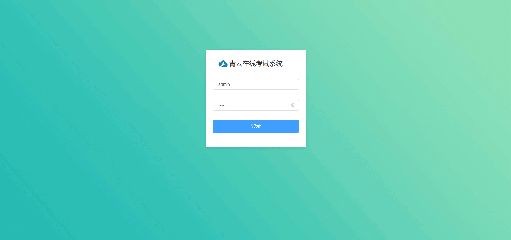
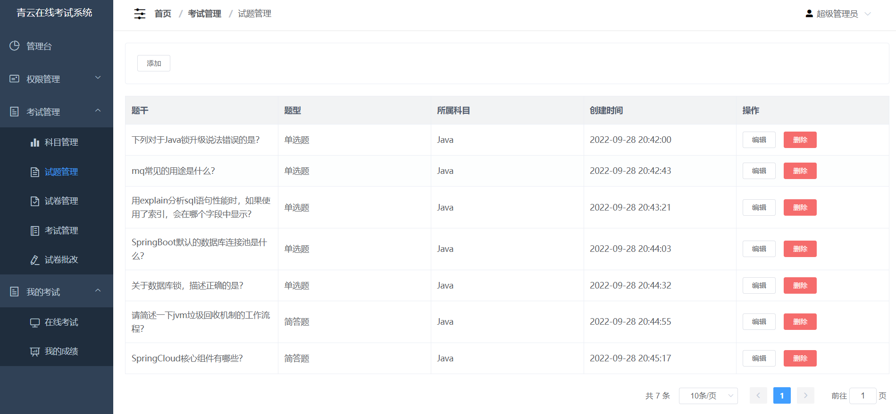
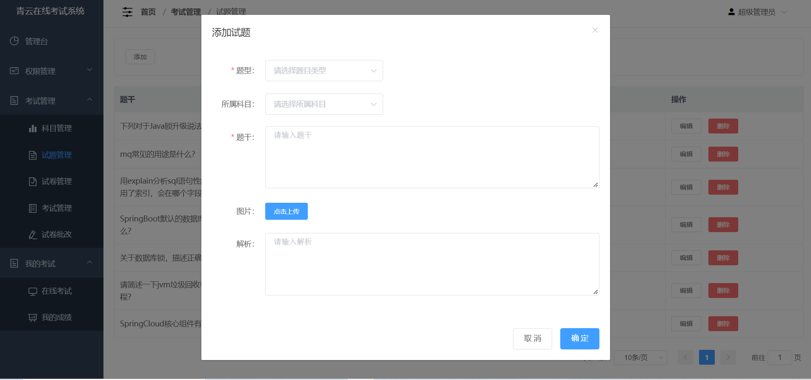
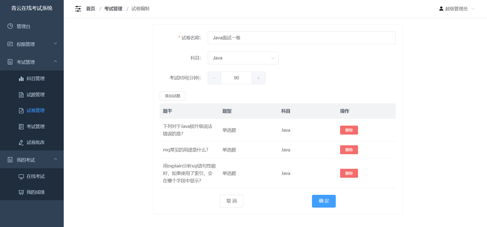
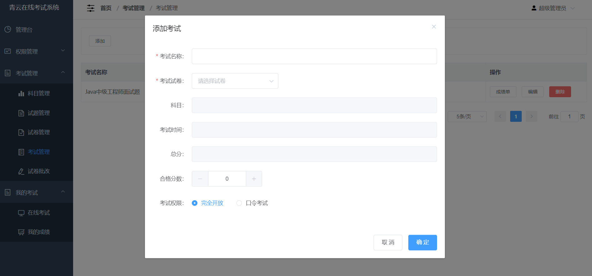
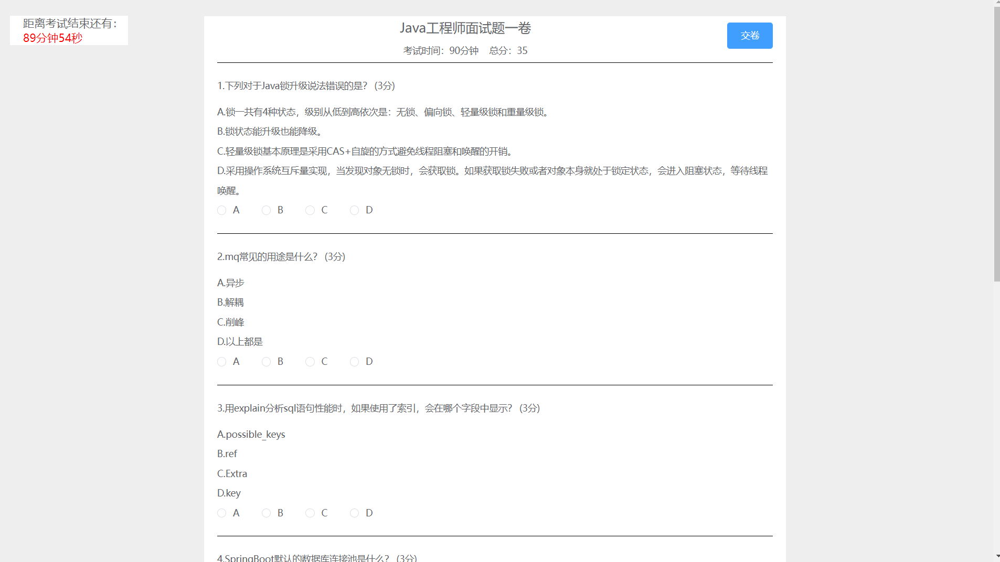
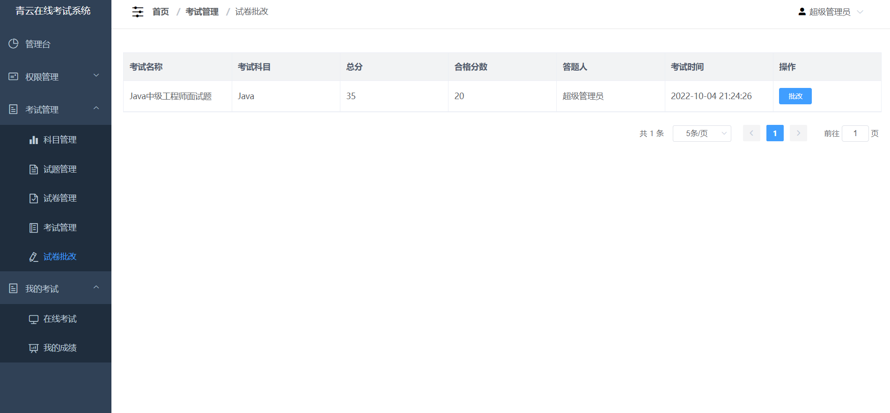
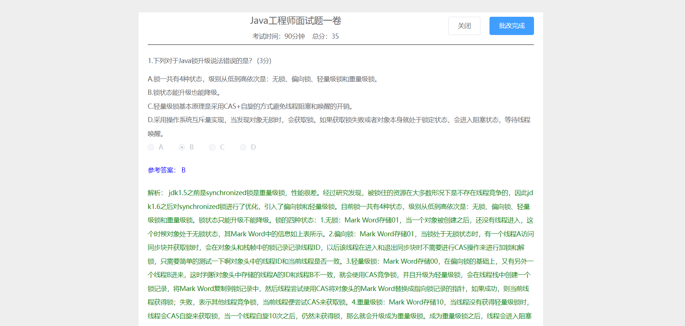
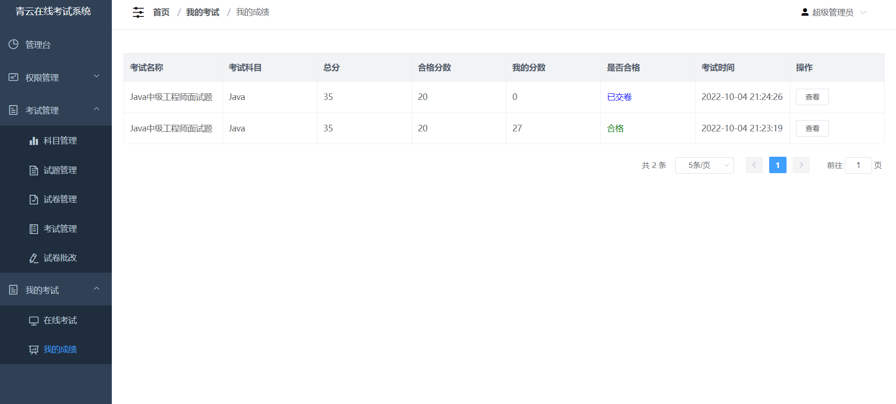
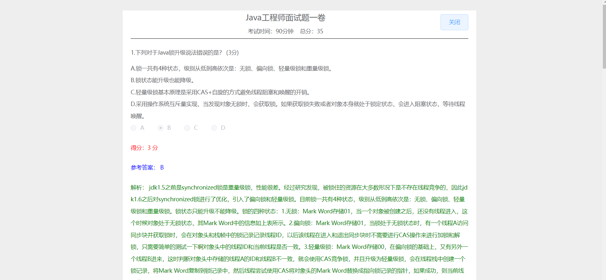

# 青云在线考试系统 

##（源代码+12000字文档+ppt）

## 项目简介

青云是一套麻雀虽小但五脏俱全的在线考试系统。 
采用了目前主流的技术栈SpringBoot+Vue+ElementUI，并进行了前后端分离。 
对于事务和锁都有应用，非常适合作为设计项目或开发学习。
视频介绍：<a href="https://www.bilibili.com/video/BV15c411A7kF/?spm_id_from=333.999.0.0" target="_blank">点击查看B站视频介绍</a>

## 项目演示

项目演示地址：http://xuezhabiji.com:5000  
账号:admin  
密码:admin  

## 功能介绍

权限管理：包含菜单管理、用户管理、角色管理、部门管理、用户权限分配。 
考试管理：包含科目管理、试题管理、试卷管理、考试管理、试卷批改。 
我的考试：包含在线考试、我的成绩。 
题型支持：目前暂时支持单选题、判断题、简答题。 
自动批改：对于单选题和判断题，系统会自动进行批改，简答题需要人工批改。 

## 技术学习

如果你在安装过程中，或对项目有疑问，可以关注本人公众号获取本人联系方式进行咨询。 
公众号内还有更多项目供你选择。 

## 技术服务

## 技术栈

| 工具及技术             | 版本    |
| ---------------------- | ------- |
| idea                   |         |
| JDK                    | 1.8     |
| SpringBoot             | 2.2.1   |
| MyBatis                | 1.3.2   |
| JWT                    | 3.4     |
| Vue                    | 2.0     |
| ElementUI              | 2.0     |
| MySQL                  | 5.7     |
| Node                   | v16.16.0|

## 安装教程

1.安装jdk1.8。 
2.安装MySQL5.7。 
3.安装node.js开发环境，前端开发环境。 
4.在mysql中创建数据库examination，导入后台代码中的examination.sql。 
5.启动前端程序和后端程序即可，后端程序默认启动端口是10000，前端调用后台默认也是调用10000端口，可自行修改。 

## 系统图片

#### 1.登录页面
 
#### 2.试题管理
 
#### 3.添加试题
 
#### 4.试卷编制
 
#### 5.添加考试
 
#### 6.参加考试
 
#### 7.试卷批改
 
 
#### 8.我的成绩
 
 
